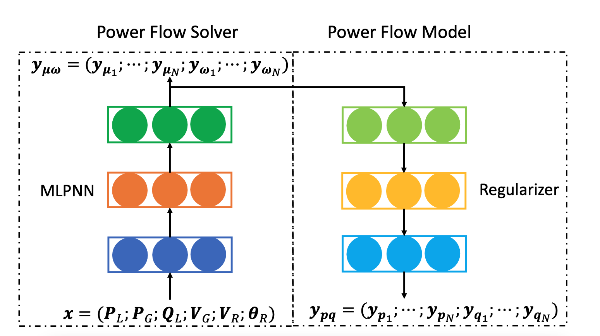
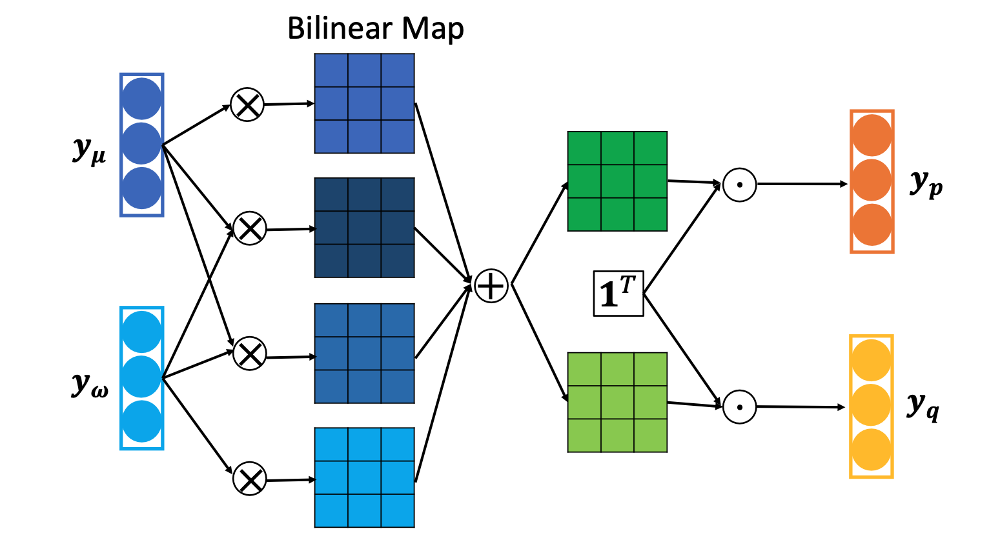
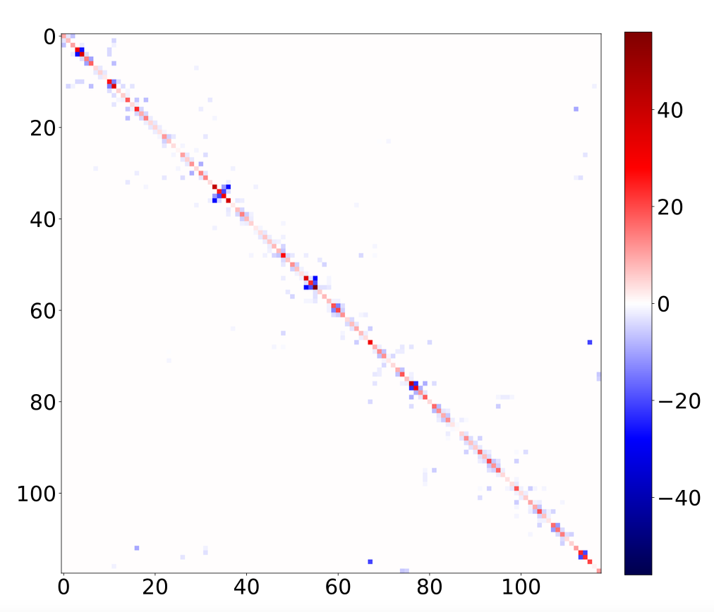
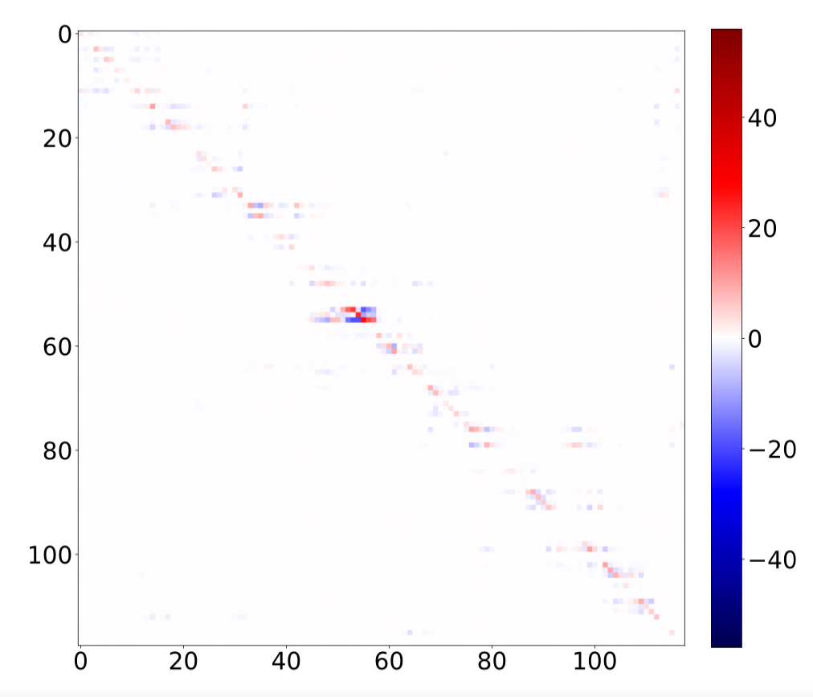
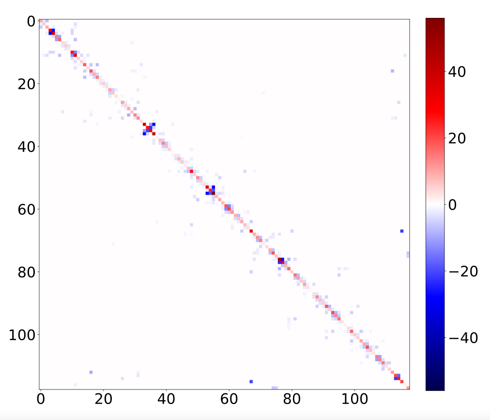

# Pytorch Implementation of Physics-guided Neural Network PF Solver
An AutoEncoder-based PF modeling and solver for dynamic and uncertain power systems, published in paper [Physics-Guided Deep Neural Networks for Power Flow Analysis](https://arxiv.org/pdf/2002.00097.pdf) (IEEE Transactions on Power Systems 2020).

| Kirchhoff’s laws has been integrated into the design of neural network | System topology knowledge has been integrated into the design of AutoEncoder|
|----------|----------|
|  |  |

By integrating physics knowledge, the weight matrices of AutoEncoder embody power system physics. See an example on IEEE 118-bus power system:
| Real Admittance matrix G | BNN parameter matrix $W_G$ | TPBNN parameter matrix $W_G$ |
|----------|----------|----------|
|  |  |  |


---
- Data is released in the data folder.

- Basic Classes and functions are released in the src folder.
  - The MLPNN black-box PF solver is contained in the [inverse file](https://github.com/xinyuesherry/Phyiscs-Guided-NN-PFsolver/blob/master/src/inverse.py).
  - The MLPNN, BNN, TPBNN PF modeling NNs are contained in the [forward file](https://github.com/xinyuesherry/Phyiscs-Guided-NN-PFsolver/blob/master/src/forward_PF_NNs.py).
  - The autoencoder-structure PF solvers (i.e., MLP+MLP, MLP+BNN, MLP+TPBNN) are contained in the [autoencoder file](https://github.com/xinyuesherry/Phyiscs-Guided-NN-PFsolver/blob/master/src/autoencoders.py).
  - Dataset specification for NNs is defined in [data preprocessing](https://github.com/xinyuesherry/Phyiscs-Guided-NN-PFsolver/blob/master/src/dataprepoc.py). You should transform your raw data to the dataset specification.
  - The code to extract the admittance matrix (topology info) from MATPOWER case specification is contained in the [power_flow_equation file](https://github.com/xinyuesherry/Phyiscs-Guided-NN-PFsolver/blob/master/src/power_flow_equations.py).


If you find this work useful for your research, please cite:
```bibtex
@article{hu2020physics,
  title={Physics-guided deep neural networks for power flow analysis},
  author={Hu, Xinyue and Hu, Haoji and Verma, Saurabh and Zhang, Zhi-Li},
  journal={IEEE Transactions on Power Systems},
  volume={36},
  number={3},
  pages={2082--2092},
  year={2020},
  publisher={IEEE}
}
